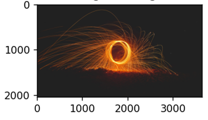
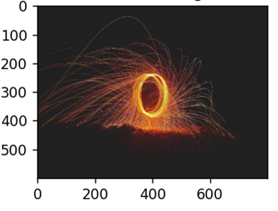

# 🧮 Cubic Spline Image Resizer

Resize images with high precision using **Cubic Spline Interpolation**.  
This project was developed to explore interpolation techniques and image manipulation in Python.

---

## ✨ Features

- Resize RGB images with minimal distortion
- Uses **CubicSpline** from `scipy.interpolate`
- Visualizes original vs. resized image
- Learn-by-doing approach for interpolation math

---

## 🛠️ How It Works

The interpolation is performed in two passes:
1. **Row-wise interpolation** for each color channel
2. **Column-wise interpolation** using the row-interpolated values

We use cubic spline interpolation to estimate new pixel values for resizing.

---

## 📸 Screenshots

| Original Image | Resized Image |
|----------------|---------------|
|  |  |

---

## 👨‍💻 Contributors
Binaya Raj Thapa

Pranay Kauri

Shashwat Khadka

Shubin Pokhrel

Siddhartha Lal Pradhan

---

⭐ Star this repository if you find it useful and educational!

